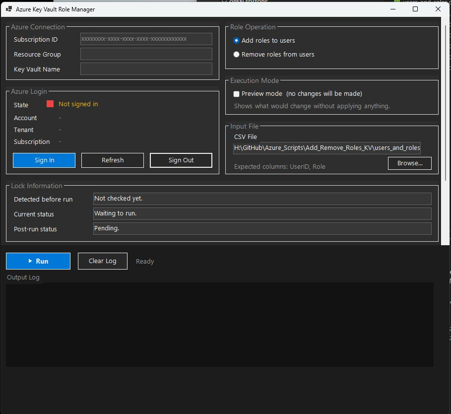

# Azure Key Vault Role Management

Manage Azure Key Vault RBAC role assignments in bulk via CSV.  
Two interfaces are available: a **GUI launcher** and a **CLI script**.

---

## GUI Version — `Launch-KeyVaultManager.ps1`

A Windows Forms GUI that wraps all CLI functionality. Azure operations run in a background thread, keeping the window fully responsive.



### How to run

```powershell
cd "<path-to-script-folder>"
.\Launch-KeyVaultManager.ps1
```

> PowerShell 5.1+ is required. No pre-login needed — use the **Sign In** button inside the GUI.

### Panel overview

| Section | Purpose |
|---|---|
| **Azure Connection** | Enter Subscription ID, Resource Group, and Key Vault Name |
| **Azure Login** | Sign in / refresh / sign out; shows current account, tenant, and subscription |
| **Role Operation** | Choose Add or Remove roles |
| **Execution Mode** | Enable Preview mode to simulate without making changes |
| **Input File** | Browse to or paste path of `users_and_roles.csv` |
| **Lock Information** | Live feed of Key Vault lock state before, during, and after the run |
| **Output Log** | Scrollable color-coded run log |

### Workflow

1. Click **Sign In** and authenticate.
2. Fill in **Subscription ID**, **Resource Group**, and **Key Vault Name**.
3. Select the operation (**Add** or **Remove**) and choose whether to use **Preview mode**.
4. Browse to your `users_and_roles.csv` file.
5. Click **▶ Run**. Progress and results appear in the Output Log.
6. If locks exist, the GUI will prompt for confirmation before removing and after the run for restore.

---

## CLI Version — `Manage-KeyVaultRoles.ps1`

Interactive command-line script. Prompts for all inputs at runtime.

### Operator SOP (Quick Run)

1. Activate PIM Owner role for the Resource Group that contains the Key Vault (if your tenant uses PIM).
2. Open PowerShell and run:

```powershell
# Go to the folder where Manage-KeyVaultRoles.ps1 is located
cd "<path-to-script-folder>"
Connect-AzAccount
Set-AzContext -SubscriptionId <your-subscription-id>
```

3. Ensure users_and_roles.csv is in the same folder as the script and has columns UserID,Role.
4. Run:

```powershell
.\Manage-KeyVaultRoles.ps1
```

5. First run recommendation:
- Choose preview mode = yes
- Review output
- Run again with preview mode = no to apply changes

6. If lock prompts appear:
- Confirm lock details are saved
- Allow temporary lock removal
- Restore lock at the end

7. Keep PIM role active until the script completes and lock restore is done.

---

## Prerequisites

> These apply to **both** the GUI and CLI versions.

### Access and Roles
You need permission to:
- Add/remove RBAC assignments
- Remove/create Key Vault locks

Recommended role: Owner on the Resource Group containing the Key Vault.

If using PIM, activate Owner before the run. User Access Administrator alone is not enough for lock remove/restore operations.

### PowerShell Modules
Required modules:
- Az.Accounts
- Az.KeyVault
- Az.Resources

The script auto-checks and can install missing modules. Manual install command:

```powershell
Install-Module -Name Az.Accounts,Az.KeyVault,Az.Resources -Scope CurrentUser
```

## Input File

File name must be: users_and_roles.csv

Required format:

```csv
UserID,Role
user1@contoso.com,Key Vault Administrator
user2@contoso.com,Key Vault Secrets Officer
```

Valid UserID values:
- User principal name (email style)
- Azure AD object ID (GUID)

## Run Flow

The script prompts for:
- Subscription ID
- Resource Group name
- Key Vault name
- Operation (Add or Remove)
- Preview mode (yes or no)

If locks exist, the script can remove and later restore them.

## Important Behavior

Applies to both versions:

- Re-running Add is safe: existing assignments are skipped.
- Remove only removes direct Key Vault scope assignments.
- Roles inherited from Resource Group/Subscription scope are skipped and reported.
- If a lock conflict appears after removal, wait 30–60 seconds and re-run (lock propagation delay).

## Quick Troubleshooting

| Symptom | Resolution |
|---|---|
| User not found in Azure AD | Verify UPN spelling / use object ID (GUID) |
| Insufficient permissions | Activate or assign Owner at Resource Group scope |
| Key Vault not found | Verify subscription, resource group, and vault name |
| `users_and_roles.csv` not found | Place file in script folder; confirm header is exactly `UserID,Role` |
| GUI won't start | Ensure PowerShell 5.1+ is used (not PowerShell 7 on some systems) |
